# Vylet

```
  w c m p b  x l o u j -
  r s t h f  y n a e i ,
  q v g d k  z * ' ; .  
```


Vylet is the product of my ongoing keyboard layout hyperfixation, which started almost 2 years ago from now (6/29/24). It's been almost 6 months since I started using it. The layout started out as a mod of [Wedlock](https://github.com/GGabi/wedlock) before evolving into its own thing. Vylet takes inspiration from [APTv3](https://github.com/Apsu/APT), [Workman](https://workmanlayout.org/), and [Magic Sturdy](https://github.com/Ikcelaks/keyboard_layouts/blob/main/magic_sturdy/magic_sturdy.md). You may want to click that last link if you don't know what a magic key `*` is, since this layout makes use of it.

## Goals
December 2023 was around the point where I started creating my own layouts by modding Wedlock. At this point I had already had a year of experience with Colemak DH, a month with Canary, and a bunch of weeks spread between a couple other layouts. Using these allowed me to get a better grasp of what I wanted out of a layout. So when setting out to make a layout tailored to me, these were the characteristics I was aiming for:
- Balanced finger use
- High inrolls
- Low scissors (with little to no full scissors)
- Low LSBs
- Low index use, but only on the right hand (most likely strain from mouse clicking)

## Background

When doing my initial modding, I would tweak a letter's position every couple of days based on my comfort with it. I did this swapping over the course of 2 months, and during this I encountered a problem: the letter `Y`

### Y

Y sucks. 

Here's a List of the top 10 SFBs in my layout:

```
Top 10 vylet SFBs:
ly    0.377%
ny    0.140%
ue    0.099%
sc    0.092%
nl    0.084%
oa    0.045%
ph    0.044%
wr    0.039%
e;    0.013%
rw    0.012%
```

all of the top 8 sfbs are addressed, either in part or in full, by one of the following techniques:
- alt fingering
- slides
- magic key

I thought about explaining what those are, but honestly if you're reading this you already know what those are. And if not, go read Ec0vid's layout doc.

## Alt Fingering

Alt fingering on a colstag keyboard is typically less preferred than rowstag, but there's still room to make it work. Namely with where I've placed my `L` and `Y` keys. The major bigrams created from this position is `LY`. Using the Monkeyracer corpus shows this bigram creates 0.38% SFBs.

I should meantion that these alt fingers don't outright erase the total SFB percentage here. Because they involve the middle finger, any word that uses a letter on the right hand middle finger (`O` or `A`), followed by `LY` is still a SFB. so words like `holy` or `really` contain SFBs.
```
Examples of ly in MONKEYRACER:
5,050 / 406,279 words (1.243%)
```
```
Examples of [ao]ly in MONKEYRACER:
71 / 406,279 words (0.017%)

analysis          (12)
holy              (12)
melancholy         (8)
italy              (5)
analyzing          (4)
analyze            (4)
paralyzed          (4)
apocalypse         (3)
analytic           (3)
olympic            (2)
```
```
Examples of lly in MONKEYRACER:
1,282 / 406,279 words (0.316%)
```
```
Examples of [ao]lly in MONKEYRACER:
1,153 / 406,279 words (0.284%)

really           (400)
actually         (119)
finally           (81)
usually           (70)
especially        (41)
eventually        (35)
literally         (21)
naturally         (21)
totally           (19)
generally         (19)
```
the `LY` alt finger does not eliminate the full 0.377% SFBs that `LY`; It instead covers 0.286% SFBS. This means 0.091% SFBs is the true amount of SFBs `LY puts on the Vylet layout.

these calculations were done by hand so there's always a chance i made a mistake, or i'm just plain missing something. just something to be aware of in case you were wondering.

`NY` is also in a good spot to be alt fingered. I had originally designed this layout with it in mind, but over time I've opted against it in favor of sliding sideways.

### NL

ok this bigram is a bit deceiving.

```
Examples of nl in MONKEYRACER:
1,176 / 406,279 words (0.289%)

only             (892)
suddenly          (84)
unless            (50)
certainly         (24)
sunlight          (14)
unlike            (14)
moonlight         (14)
commonly           (7)
online             (7)
unlikely           (6)
```
Out of the 1,176 instances of `nl` in the corpus, 892 of them are from `only` (76% of all `nl` instances). and in vylet, the `nl` bigram in `only` gets split up by typing `on` as normal and then alt fingering `ly`. I thought this would be slow but I'm consistently able to get burst speeds over 100wpm with this particular word. so at least for this bigram, I'm realistically only dealing with a quarter of the `nl` SFBs (which would be 0.021%).

## Slides

`OA`, `UE`, and `PH` are all comfortable downwards slides for me. `NY` is also a slide, just a sideways one.

## Magic Key

This leaves me with two bigrams to address: `SC` and `WR`. I could slide `SC`, but upwards slides are much less comfortable than their downwards counterpart. `WR` is downwards, but is on the pinky which doesn't feel well-suited to do slides at least for my hands. This is why they would ultimately become rules for my magic key.

### Magic Key Rules

```
// full scissor bigram (FSB)
c★      ⇒ ck
'★      ⇒ 'l
l★      ⇒ ll

// half scissor bigram (HSB)
g★      ⇒ gh
p★      ⇒ pt
r★      ⇒ rk

// same finger bigram (SFB)
s★      ⇒ sc
w★      ⇒ wr

// lateral stretch bigram (LSB)
f★      ⇒ ft
m★      ⇒ mb

// half scissor LSB
b★      ⇒ bt
a★      ⇒ ax
e★      ⇒ ex
i★      ⇒ ix
```

## Top SFBS revisited

```
Top 10 vylet SFBs:
ly    0.091%
ny    0.000%
ue    0.000%
sc    0.000%
nl    0.021%
oa    0.000%
ph    0.000%
wr    0.000%
e;    0.013%
rw    0.012%
```

fyi i'm treating this like a blog and less like a concise description of my layout. like i'll talk about specifics with my layout but also wanna go into what got me there in the first place. enjoy the ride :D

## Background
Vylet is the product of my ongoing keyboard layout hyperfixation, which started almost 2 years ago from now (6/29/24). I stumbled on the [r/keyboardlayouts subreddit](https://www.reddit.com/r/KeyboardLayouts/), which led to me learning a few different alternative keyboard layouts over the course of a year and a half. By mid-December 2023, I started creating my own layouts and would tweak a letter's position every couple of days based on my comfort with it. I did this over the course of 2 months, and by February I had the first concrete version of Vylet: 

```
  w c m p k  q l o u j -
  r s t h f  y n a e i ,
  z v g d b  x * ' / .  
```

Cool! It's still a few swaps off from being the current version, but it's close enough where I wouldn't consider it outright different.

## Motivation


## Analyzer Stats

### Cyanophage


Here's the [link](https://cyanophage.github.io/playground.html?layout=wcmpbxlouj-rsthfynaei%2Cqvgdkz%2F%27%3B.%5C&mode=ergo) if you want to edit Vylet yourself.

### Keysolve


### Layout Playground


### cmini

```
vylet (acas) (10 likes)
  w c m p b  x l o u j -
  r s t h f  y n a e i ,
  q v g d k  z * ' ; .  

MONKEYRACER:
  Alt: 27.00%
  Rol: 47.40%   (In/Out: 32.99% | 14.42%)
  One:  2.99%   (In/Out:  1.16% |  1.82%)
  Rtl: 50.39%   (In/Out: 34.15% | 16.24%)
  Red:  3.98%   (Bad:     0.26%)

  SFB: 0.93%
  SFS: 6.03%    (Red/Alt: 1.85% | 4.18%)

  LH/RH: 45.22% | 54.78%
```
```
Top 10 vylet SFBs:
ly    0.377%
ny    0.140%
ue    0.099%
sc    0.092%
nl    0.084%
oa    0.045%
ph    0.044%
wr    0.039%
e;    0.013%
rw    0.012%
```
```
Top 10 vylet SFS:
gt    0.547%
wr    0.462%
ue    0.461%
ln    0.388%
ao    0.351%
o'    0.304%
mt    0.253%
tm    0.250%
i.    0.207%
cs    0.184%
```
```
Top 10 vylet Alternates:
hat   0.865%
her   0.635%
ver   0.509%
for   0.449%
ome   0.400%
his   0.362%
ter   0.359%
are   0.341%
ave   0.315%
wit   0.280%
```
```
Top 10 vylet Rolls:
the   2.656%
ing   1.382%
and   1.191%
tha   0.664%
thi   0.598%
hin   0.479%
our   0.443%
ent   0.376%
rea   0.344%
not   0.331%
```
```
Top 10 vylet Inrolls:
the   2.656%
ing   1.382%
and   1.191%
tha   0.664%
thi   0.598%
hin   0.479%
ent   0.376%
rea   0.344%
the   0.311%
ith   0.308%
```
```
Top 10 vylet Onehands:
you   1.166%
ion   0.383%
you   0.182%
eal   0.127%
ien   0.093%
rst   0.083%
ean   0.077%
ou.   0.056%
ual   0.056%
rth   0.053%
```
```
Top 10 vylet Redirects:
one   0.359%
oul   0.249%
ain   0.210%
oun   0.172%
ine   0.161%
str   0.126%
lea   0.126%
oin   0.098%
eli   0.086%
thr   0.084%
```

#### Finger Use
```
vylet (usage) (acas) (10 likes)
  w c m p b  x l o u j -
  r s t h f  y n a e i ,
  q v g d k  z * ' ; .  

MONKEYRACER:
  LI: 13.30%    RI: 14.10%
  LM: 12.52%    RM: 16.11%
  LR:  9.33%    RR: 16.58%
  LP:  8.20%    RP:  9.85%

  Total: 100.00%
```
```
vylet (sfb) (acas) (10 likes)
  w c m p b  x l o u j -
  r s t h f  y n a e i ,
  q v g d k  z * ' ; .  

MONKEYRACER:
  LI:  0.09%    RI:  0.42%
  LM:  0.04%    RM:  0.08%
  LR:  0.11%    RR:  0.13%
  LP:  0.05%    RP:  0.02%

  Total: 0.93%
```
```
vylet (sfs) (acas) (10 likes)
  w c m p b  x l o u j -
  r s t h f  y n a e i ,
  q v g d k  z * ' ; .  

MONKEYRACER:
  LI:  0.81%    RI:  0.93%
  LM:  1.20%    RM:  1.00%
  LR:  0.53%    RR:  0.66%
  LP:  0.57%    RP:  0.41%

  Total: 6.11%
```
```
vylet (acas) (10 likes)
MONKEYRACER:
Unweighted Speed
    LP: 2.812
    LR: 3.784
    LM: 6.448
    LI: 8.107
    RI: 17.668
    RM: 8.545
    RR: 3.801
    RP: 2.418

Weighted Speed
    LP: 1.874
    LR: 1.051
    LM: 1.343
    LI: 1.474
    RI: 3.212
    RM: 1.780
    RR: 1.056
    RP: 1.612
```

## Credits
Cyanophage, Pine, and Oxey
