# Vylet



```
  w c m p b  x l o u j -
  r s t h f  y n a e i ,
  q v g d k  z * ' ; .  
```
`*/★` = magic key

Vylet is the product of my ongoing keyboard layout hyperfixation, which started about 2 years ago from now. It's been almost 6 months since I started using it. The layout started out as a mod of [Wedlock](https://github.com/GGabi/wedlock) before evolving into its own thing. Vylet takes inspiration from [APTv3](https://github.com/Apsu/APT), [Workman](https://workmanlayout.org/), and [Magic Sturdy](https://github.com/Ikcelaks/keyboard_layouts/blob/main/magic_sturdy/magic_sturdy.md). You may want to click that last link if you don't know what a magic key `*` is, since this layout makes use of it. It also takes advantage of alt fingerings and slides, so I hope you know what those are too. If not, go read Ec0vid's layout doc.

## Goals
By the time I started making my own mods/layouts in December 2023, I had already had a year of experience with [Colemak DH](https://colemakmods.github.io/mod-dh/), a month with [Canary](https://github.com/Apsu/Canary), and a bunch of weeks spread between a couple other layouts. Learning and typing daily with these allowed me to get a better grasp of what I wanted out of a layout. So when setting out to make a layout tailored to me, these were the characteristics I was aiming for:
- Balanced finger use
- High inrolls
- Low scissors (with little to no full scissors)
- Low LSBs
- Low index use, but only on the right hand (most likely strain from mouse clicking)

## Background

When doing my initial modding, I would tweak a letter's position every couple of days based on my comfort with it. I did this over the course of 2 months, and eventually realized I was making something very similar to APTv3. I had originally passed on learning this layout when I heard about it a year ago, but on second look it seemed like it had all the characteristics I was looking for. There was one exception: the letter `Y`.

On APTv3, `Y` is placed on the top row of the right pinky. This would break my rules by introducing some nasty pinky-ring scissor interactions, as well as putting the pinky's usage above what I'd prefer. This is what got me thinking about where to place Y, and deciding to optimize its placement based on alt fingering.

## Alt Fingering

The placement of `Y` in Vylet creates only 2 significant bigrams: `LY` and `NY`. Both of these bigrams can be alt fingered comfortably, which negates most of the SFBs this `Y` placement creates. We're just gonna focus on talking about `LY` since its the far more important SFB, and I tend to slide `NY` instead of alting it anyway.

Keep in mind that alt fingering doesn't just erase the total SFB percentage here (which is 0.377% in Monkeyracer). The `LY` alt finger starts with the middle finger, meaning any word that uses a letter on the right hand middle finger (`O` or `A`), followed by `LY` is still a SFB. This means words like `holy` or `really` contain SFBs in Vylet.

Taking this into account, the SFBs caused by `LY` in this layout isn't 0.377%, but instead is 0.091%.

## Slides

`OA`, `UE`, and `PH` are all comfortable downwards slides for me. `NY` is also a slide, just a sideways one. It's worth mentioning that this technique doesn't work as well if you're on a standard mechanical keyboard with the taller, more spaced out keys. Low profile keyboards with light switches, and especially laptop keyboards are best suited for this.

## Magic Key

This leaves me with two significant SFBs in Vylet to address: `SC` and `WR`. I could slide `SC`, but upwards slides are much less comfortable than their downwards counterpart. `WR` is downwards, but is on the pinky which doesn't feel well-suited to do slides at least for my hands. This is why they would ultimately become rules for my magic key.

The magic key was a later addition to Vylet. It originally started as a way to fix the `SC` SFB and `CK` scissor, but has grown to be quite more useful than that.

### Magic Key Rules

Here is my full set of magic rules used on Vylet.

```
// full scissor bigram (FSB)
c★      ⇒ ck
'★      ⇒ 'l
l★      ⇒ ll

// half scissor bigram (HSB)
g★      ⇒ gh
p★      ⇒ pt
r★      ⇒ rk

// same finger bigram (SFB)
s★      ⇒ sc
w★      ⇒ wr

// lateral stretch bigram (LSB)
f★      ⇒ ft
m★      ⇒ mb

// half scissor LSB
b★      ⇒ bt
a★      ⇒ ax
e★      ⇒ ex
i★      ⇒ ix
```

Most of these should be self-explanatory except the 3 `X` rules at the end. `X` can be annoying on the vowel side because in words, it's often between 2 other vowels (`exist`, `exactly`, `example`, etc.). This means any involvement of `X` in a word is likely going to be a redirect. these 3 rules make the redirects less of an issue since `X` is now in a closer, more comfortable spot.

My implementation of the magic key into my QMK config is done through [Sequence Transform](https://github.com/Ikcelaks/qmk_sequence_transform). It's what allows me to create magic rules with the extremely simple syntax you saw above. You can also do a bunch of other more complex things with it, I just don't take full advantage of that.

## Credits
[Cyanophage](https://cyanophage.github.io/index.html), [Pine](https://clemenpine.github.io/keysolve-web/), and [Oxey](https://oxey.dev/playground/index.html) for their web-based keyboard layout analyzers. Their ease of access has been invalable for me.
